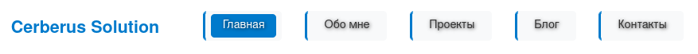

# My First Static Website

An educational project for hands-on practice with modern web workflows:

- Git & GitHub
- Web development (HTML/CSS)

I'm building this site as a simple static website to learn and demonstrate the workflow.

---

## Features

- Minimal static site (HTML/CSS)
- Simple structure suitable for learning and experimentation

## Preview

Add an optional hero or screenshot image to the `assets/` folder and reference it here:

_(If you want, provide images and I'll include them in the repo.)_

## Prerequisites

- Git (optional, for cloning the repo)

## Quick start

1. Clone the repository:

	git clone <repo-url>

2. Open index.html in your browser or serve the folder with a static file server (e.g., python -m http.server).

## Project structure

- index.html — main page
- css/ — styles
- assets/ — images and static assets

## Contributing

Suggestions and improvements are welcome. Create issues or pull requests on GitHub.

## License

This project is for learning purposes. Add a license file if you plan to reuse or share code.

---

Enjoy experimenting with Docker and web development!
=======
# Мой первый сайт

Это учебный проект для практики:
- Git и GitHub
- Веб-разработка (HTML/CSS)
